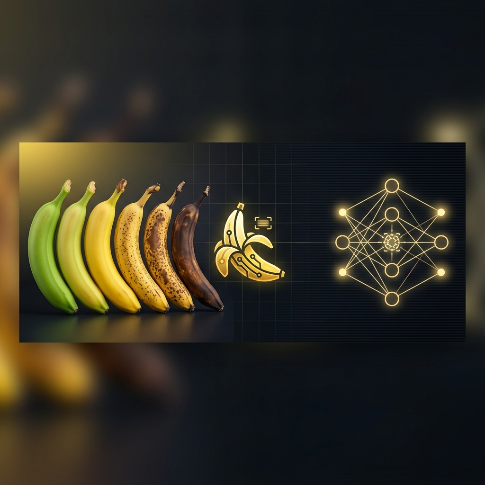
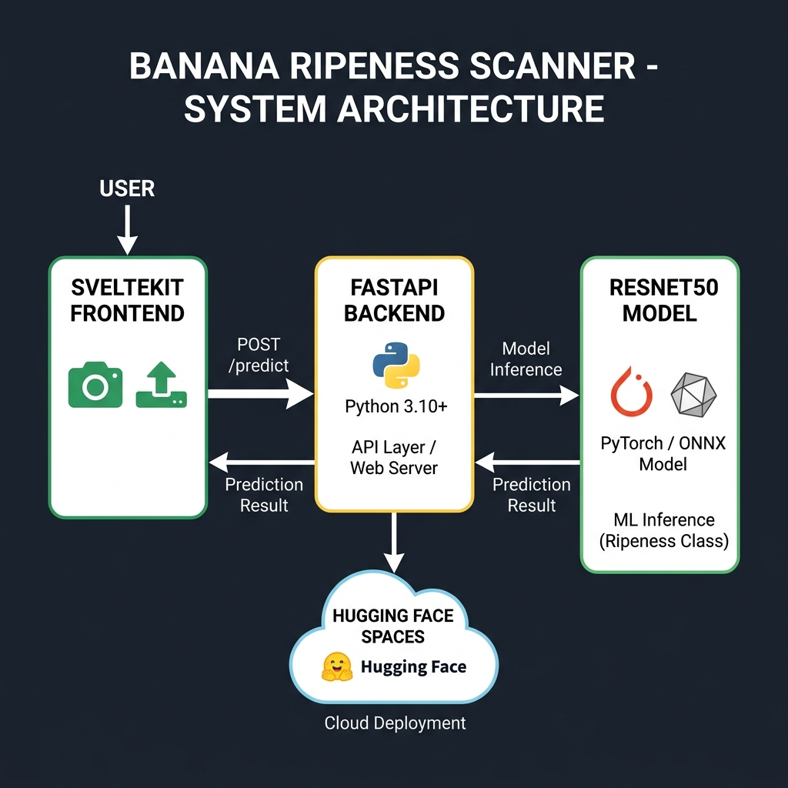

<p align="center">
  
</p>

<h1 align="center">🍌 Banana Scanner</h1>

<p align="center">
  <strong>AI-Powered Banana Ripeness Detection — From Green to Gone</strong>
</p>

<p align="center">
  <a href="#-features"></a>
  <a href="#-tech-stack"></a>
  <a href="#-tech-stack"></a>
  <a href="#-tech-stack"></a>
  <a href="#-deployment"></a>
  <br /><br />
  <a href="https://pytorch.org/"></a>
</p>

<p align="center">
  <em>A deep learning project built from scratch — custom dataset, custom training, real-time predictions.</em>
</p>

---

## 📖 About

**Banana Scanner** is an end-to-end machine learning project that classifies banana ripeness into **8 distinct stages** using a fine-tuned **ResNet50** convolutional neural network. This was one of my first projects while learning **PyTorch**, **OpenCV**, and machine learning — I collected and curated the training dataset myself, trained the model from the ground up, and then wrapped it into a full-stack web application with a live camera-powered UI.

Point your phone camera at a banana, snap a photo, and instantly get:
- 🏷️ **Ripeness classification** across 8 degrees
- ⏳ **Estimated shelf life** remaining
- 💡 **Smart usage recommendations** (eat now, bake, freeze, etc.)
- 📊 **Confidence score** for the prediction

> _"Because knowing when your banana is perfect shouldn't require a PhD."_

---

## ✨ Features

| Feature | Description |
|---|---|
| 🎯 **8-Stage Classification** | Detects ripeness from fully green (Degree 1) to fully brown/black (Degree 8) |
| 📸 **Real-Time Camera** | Uses device camera with environment-facing mode for instant scanning |
| 🧠 **Deep Learning** | Fine-tuned ResNet50 with custom FC head + Dropout regularization |
| ⚡ **Fast Inference** | Async FastAPI backend with thread-pooled prediction — non-blocking |
| 📱 **Mobile-First UI** | Responsive glassmorphic SvelteKit frontend, optimized for phones |
| ☁️ **Cloud Deployed** | Dockerized and deployable to Hugging Face Spaces |
| 🔄 **ONNX Export** | Model export pipeline for optimized cross-platform inference |

---

## 🧬 Ripeness Classification Map

The model classifies bananas into **8 stages**, each mapped to practical, actionable information:

```
 Stage 1 ──► Stage 2 ──► Stage 3 ──► Stage 4 ──► Stage 5 ──► Stage 6 ──► Stage 7 ──► Stage 8
 🟢 Green   🟢🟡 Hint  🟡 Yellow   🟡 Full    🟡🟤 Spots  🟤 Half    🟤 Mostly   ⚫ Fully
             of Yellow   More Yel.    Yellow                  Brown      Brown       Brown
 14 days      10 days     7 days      4 days      3 days      2 days     1 day       0 days
```

| Degree | Visual Stage | Shelf Life | Recommendation |
|:---:|---|:---:|---|
| 1 | 🟢 Green / Unripe | 10–14 days | High shelf life. Ideal for long-term storage. |
| 2 | 🟢🟡 Slight Yellow | 8–10 days | Ready to eat soon. Good for storage. |
| 3 | 🟡 More Yellow | 5–7 days | Optimal sweetness & firmness. Enjoy now or store briefly. |
| 4 | 🟡 Fully Yellow | 3–4 days | Perfectly ripe and sweet! Eat soon. |
| 5 | 🟡🟤 Small Spots | 2–3 days | Very sweet. Best for immediate consumption. |
| 6 | 🟤 Half Brown Spots | 1–2 days | Excellent for baking, smoothies, or freezing. |
| 7 | 🟤 Mostly Brown | 0–1 day | Use immediately. Ideal for banana bread. |
| 8 | ⚫ Fully Brown/Black | 0 days | Overripe. Best used in cooked/baked goods. |

---

## 🏗️ Architecture

<p align="center">
  
</p>

The project follows a **decoupled client-server architecture**:

```
┌─────────────────────┐       POST /predict        ┌──────────────────────┐
│                     │    (multipart/form-data)    │                      │
│   SvelteKit + TW    │ ─────────────────────────►  │   FastAPI + Uvicorn  │
│   (Camera UI)       │                             │   (REST API)         │
│                     │  ◄─────────────────────────  │                      │
│   📸 → 🖼️ → 📤     │     JSON { class, days,    │   🧠 ResNet50        │
│                     │       confidence, msg }     │   (PyTorch .pth)     │
└─────────────────────┘                             └──────────────────────┘
        ▲                                                     │
        │                                                     ▼
   Browser / Mobile                                   Hugging Face Spaces
                                                      (Docker Container)
```

### How It Works

1. **📸 Capture** — The SvelteKit frontend accesses the device camera, crops the frame to a square, and resizes to `224×224` pixels
2. **📤 Upload** — The captured JPEG blob is sent as `multipart/form-data` to the `/predict` endpoint
3. **🔄 Preprocess** — FastAPI receives the image, PIL converts it to RGB, and PyTorch transforms apply ImageNet normalization
4. **🧠 Infer** — The fine-tuned ResNet50 runs a forward pass, producing logits for 8 classes
5. **📊 Postprocess** — Softmax probabilities are computed, the top class is mapped to ripeness info
6. **✅ Respond** — A JSON payload with `class`, `days_left`, `confidence`, and `message` is returned

---

## 🛠️ Tech Stack

### Machine Learning
| Technology | Purpose |
|---|---|
| **PyTorch** | Model training, fine-tuning, and inference |
| **torchvision** | ResNet50 architecture + image transforms |
| **ONNX** | Cross-platform model export (opset 17) |
| **Pillow (PIL)** | Image preprocessing pipeline |
| **NumPy** | Tensor operations |

### Backend
| Technology | Purpose |
|---|---|
| **FastAPI** | High-performance async REST API |
| **Uvicorn** | ASGI server with `asyncio.to_thread` for non-blocking inference |
| **Python 3.9** | Runtime |

### Frontend
| Technology | Purpose |
|---|---|
| **SvelteKit 2** | Reactive UI framework with SSR |
| **Svelte 5** | Component library with `$props()` runes |
| **TailwindCSS 3** | Utility-first styling |
| **Web APIs** | `getUserMedia` for camera, `Canvas` for image processing |

### DevOps
| Technology | Purpose |
|---|---|
| **Docker** | Containerized deployment |
| **Hugging Face Spaces** | Free cloud hosting for the API |

---

## 🚀 Getting Started

### Prerequisites

- **Python 3.9+**
- **Node.js 18+** & **npm**
- Model weights file: `best_banana_ripeness_resnet.pth` (not included in repo — too large)

### 1. Clone the Repository

```bash
git clone https://github.com/githarshking/Banana-scanner-web.git
cd Banana-scanner-web
```

### 2. Start the Backend API

```bash
# Create a virtual environment
python -m venv venv
source venv/bin/activate        # Linux/Mac
# venv\Scripts\activate         # Windows

# Install dependencies
pip install -r api_requirements.txt

# Run the server
python app.py
```

The API will be live at `http://127.0.0.1:8000` with Swagger docs at `/docs`.

### 3. Start the Frontend

```bash
cd frontend
npm install
npm run dev
```

The UI will be available at `http://localhost:5173`.

### 4. Test the API (Optional)

```bash
# Edit TEST_IMAGE_PATH in test_api.py, then:
python test_api.py
```

Expected output:
```json
{
  "class": "degree4 (Fully Yellow)",
  "days_left": "3 - 4 days",
  "message": "Perfectly ripe and sweet! Eat soon.",
  "confidence": 0.9247
}
```

---

## 🐳 Docker Deployment

Build and run the API container locally:

```bash
docker build -t banana-scanner .
docker run -p 7860:7860 banana-scanner
```

For **Hugging Face Spaces** deployment, push the repo to a Docker Space — the `Dockerfile` is pre-configured with:
- Non-root user (security requirement)
- Port `7860` (HF Spaces standard)
- CPU-optimized PyTorch

---

## 📁 Project Structure

```
banana-scanner-web/
├── app.py                          # FastAPI server entry point
├── predict_logic.py                # Model loading, preprocessing & inference
├── export_resnet50.py              # PyTorch → ONNX model export script
├── test_api.py                     # API integration test client
├── api_requirements.txt            # Python dependencies
├── Dockerfile                      # Production container config
├── best_banana_ripeness_resnet.pth # Trained model weights (git-ignored)
│
├── frontend/                       # SvelteKit web application
│   ├── src/
│   │   ├── routes/
│   │   │   ├── +page.svelte        # Main scanner UI (camera + results)
│   │   │   └── +layout.svelte      # Root layout
│   │   ├── app.css                 # Tailwind imports
│   │   └── app.html                # HTML shell
│   ├── static/
│   │   └── bg.jpg                  # Background texture
│   ├── package.json
│   ├── svelte.config.js
│   ├── tailwind.config.js
│   └── vite.config.js
│
└── assets/                         # README images
    ├── banner.png
    └── architecture.png
```

---

## 🧪 Model Details

| Attribute | Value |
|---|---|
| **Architecture** | ResNet50 (modified FC head) |
| **Pre-training** | ImageNet weights (transfer learning) |
| **Custom Head** | `Dropout(0.5)` → `Linear(2048, 8)` |
| **Input Resolution** | 224 × 224 × 3 (RGB) |
| **Normalization** | ImageNet mean/std (`[0.485, 0.456, 0.406]` / `[0.229, 0.224, 0.225]`) |
| **Output** | 8-class softmax probabilities |
| **Dataset** | Custom collected & curated banana images |
| **Export Format** | `.pth` (PyTorch) + `.onnx` (ONNX opset 17) |
| **Inference Device** | CPU (optimized for web deployment) |

---

## 🔌 API Reference

### `POST /predict`

Upload an image and receive a ripeness prediction.

**Request:**
```
Content-Type: multipart/form-data

file: <image/jpeg | image/png>
```

**Response** `200 OK`:
```json
{
  "class": "degree3 (More Yellow)",
  "days_left": "5 - 7 days",
  "message": "Optimal balance of sweetness and firmness. Enjoy now or store briefly.",
  "confidence": 0.8734
}
```

**Error Responses:**
| Code | Description |
|:---:|---|
| `400` | Invalid file type (non-image) |
| `500` | Internal server error |
| `503` | Model not loaded / service unavailable |

---

## 📝 Lessons Learned

This project was a foundational learning experience that taught me:

- **🔥 PyTorch Fundamentals** — Building, training, and fine-tuning CNNs from scratch
- **📸 OpenCV & Image Processing** — Dataset collection, augmentation, and preprocessing pipelines
- **🔄 Transfer Learning** — Leveraging ImageNet pre-trained ResNet50 and adapting it to a custom domain
- **⚡ Model Serving** — Wrapping ML models in production-grade async APIs
- **🌐 Full-Stack Integration** — Connecting a reactive frontend to a Python ML backend
- **🐳 Containerization** — Dockerizing ML applications for cloud deployment
- **📦 ONNX Export** — Converting PyTorch models for cross-platform inference

---

## 🤝 Contributing

Contributions are welcome! If you'd like to improve the model, UI, or add new features:

1. Fork the repository
2. Create your feature branch (`git checkout -b feature/amazing-feature`)
3. Commit your changes (`git commit -m 'Add amazing feature'`)
4. Push to the branch (`git push origin feature/amazing-feature`)
5. Open a Pull Request

---

## 📜 License

This project is open source and available for learning purposes.

---

<p align="center">
  <strong>Built with 🍌 and curiosity</strong>
  <br />
  <sub>A first step into the world of deep learning — from collecting data to deploying models.</sub>
</p>
